# The Indian Express Clone
Got an individual project to clone Indian Express website. Indian Express Limited is an Indian news media publishing company. It publishes several widely circulated dailies, including The Indian Express and The Financial Express in English, the Loksatta in Marathi and the Jansatta in Hindi.

In this project i have made the foolowing things :
 - Home Page
 - Header
 - Sign In Page
 - Sports Page
 - Sports Detail Page
 - Education Page
 - Education Detail Page
 - Footer

---

### [click here to run live demo](https://rkee0054.netlify.app/)

## Tech stacks used :
* **HTML**
* **CSS**
* **JAVASCRIPT**
* **CHAKRA-UI**
* **REACT JS**

 

***
## Landing Page :
- The Landing Page of Indian Express website displays various news like india news , world news , latest news, top news.
- In top section there is a Header which includes various routes ,logo, drawer and search, sign in and sign out button.
- At the bottom section there is a footer, both Header & Footer are same across all the pages.
- Used sliders and filters. Using filters user can see any of the listed countries data.  

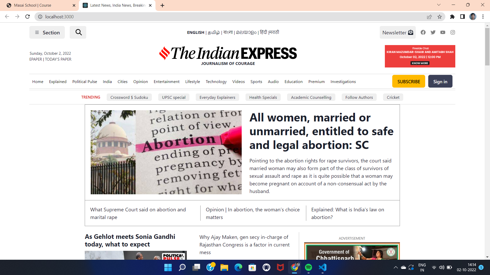

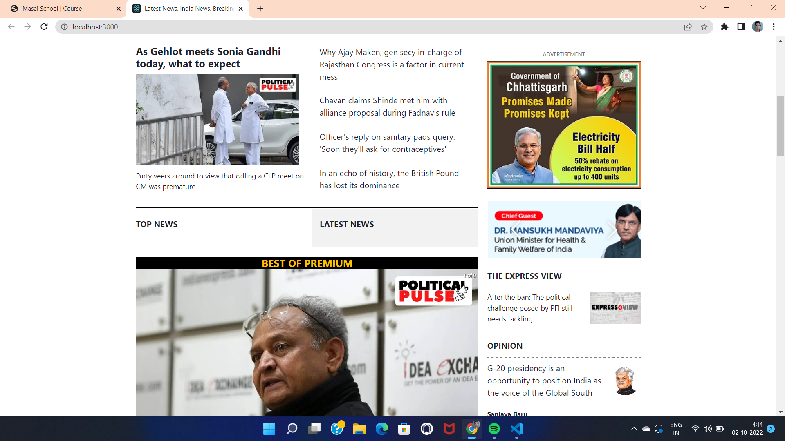

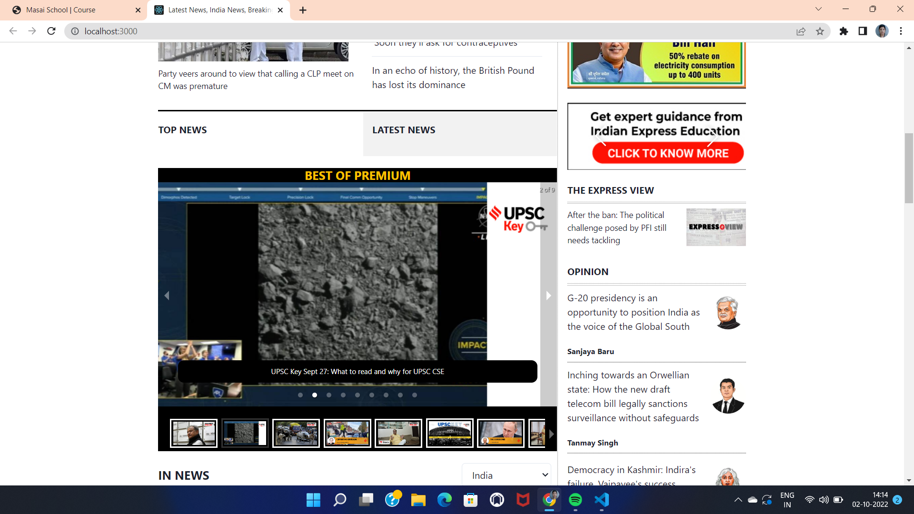

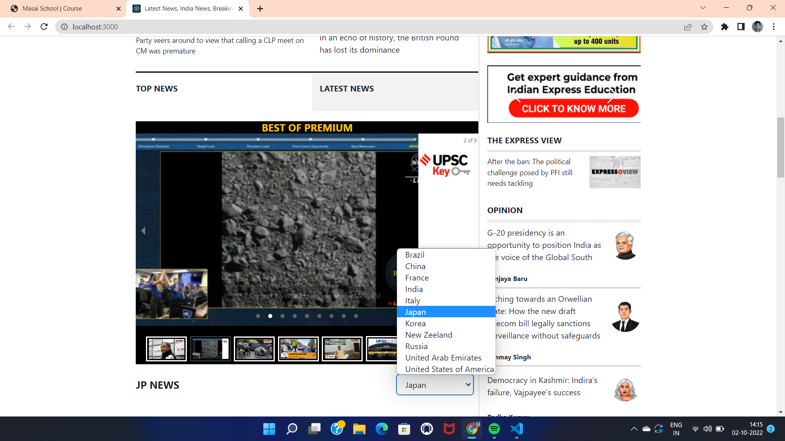

## Sign In page :
- User by clicking on sign in button move to login page .
- After login, button text changed to sign out and by clicking it user will be logged out.
- Here I used reqres.in api for login.
- Email:eve.holt@reqres.in
- Password: "cityslicka

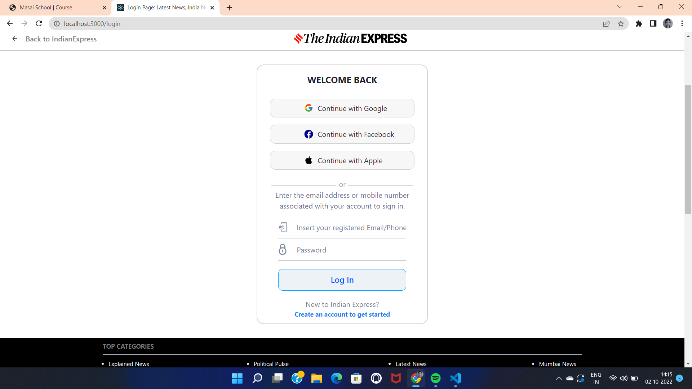

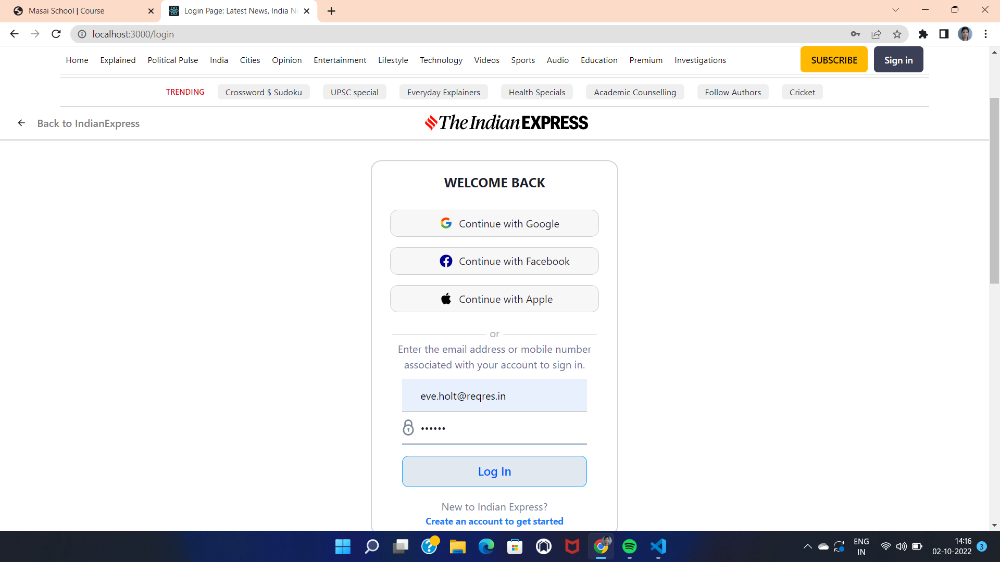

## Section Button:
- Clicking on this button a drawer will open from top and from there also we can go to any page 
- From Here you can go to sports and education page which i only made.

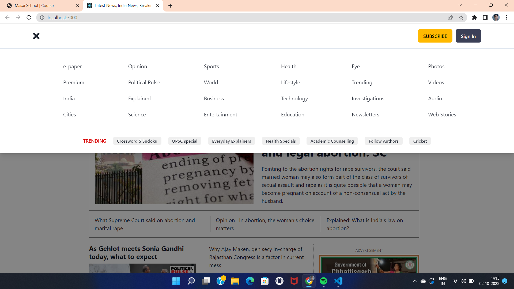

## Search :
- By clicking on Search  a modal will open and user can enter which news they want to see. 
- Here I have given the search for sports page only. You can input "sports" it will redirect you sports page.

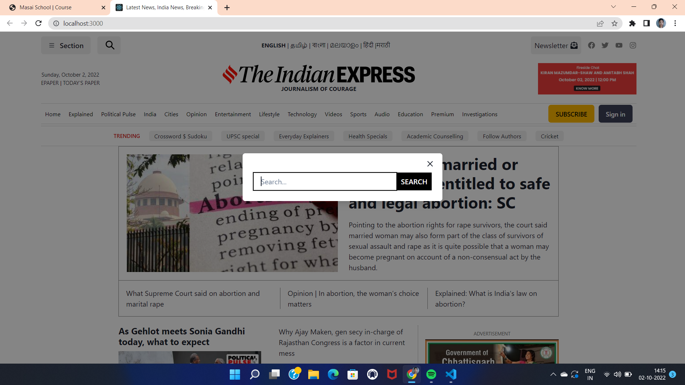

## Sports Page :
- By clicking on sports in navbar user can also move to sports page.
- Here I used Api for fetching sports data and some static data are also here in top part. 
- Used Sliders and breadcrumbs.
- By clicking on any data user will be redirected to respective sports detail page.

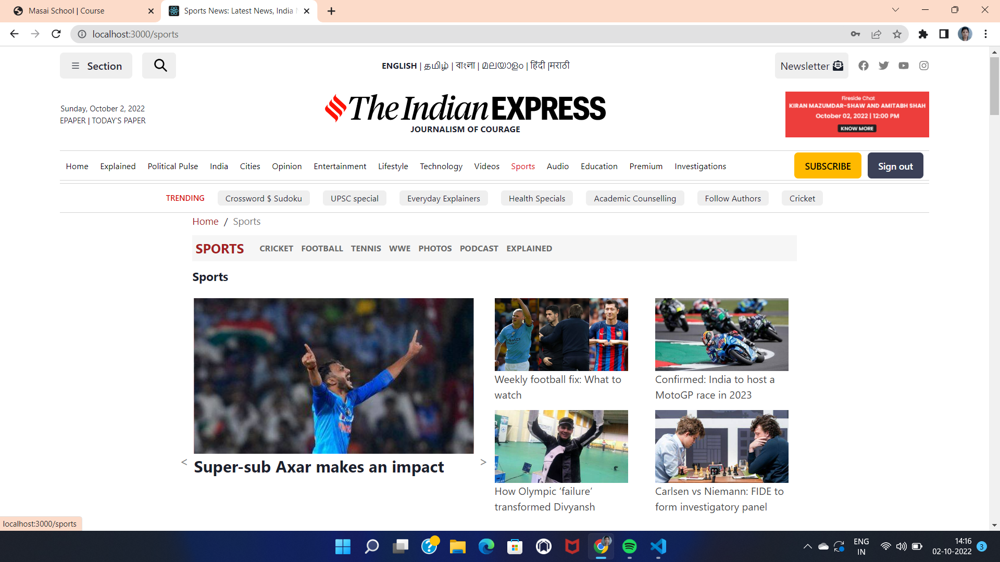

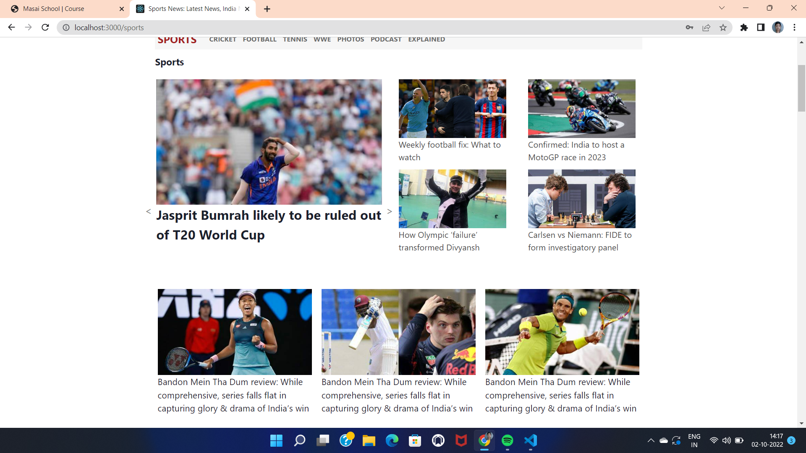

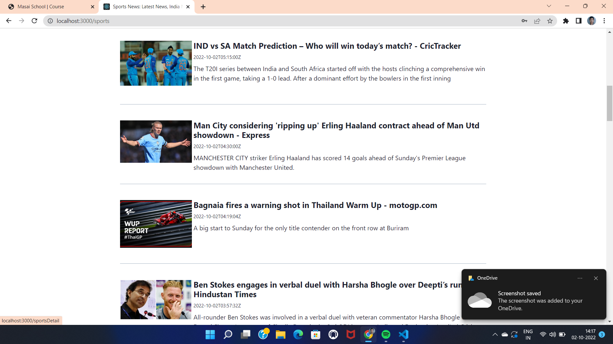

## Sports Detail Page :
- In this page every detail related to that news are shown.

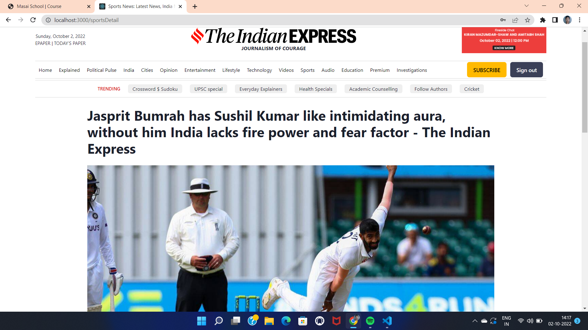

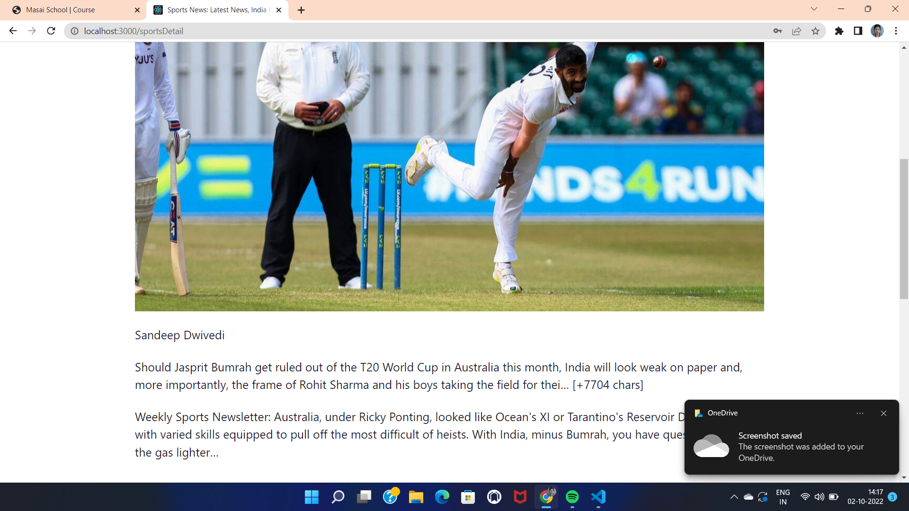

## Education Page : 
- By clicking on education in navbar user can also move to education page.
- Here I used Api for fetching education data and some static data are also here in top part. 
- Used Sliders and breadcrumbs.
- By clicking on any data user will be redirected to respective education detail page.

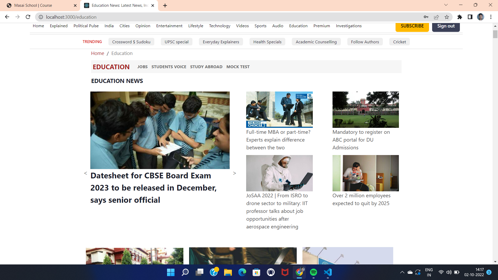

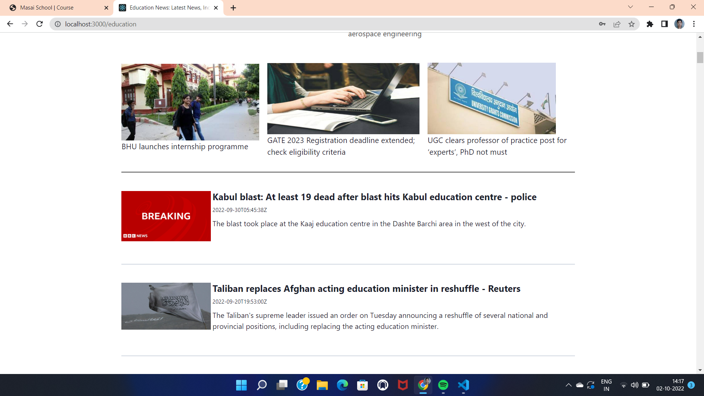

## Education Detail Page :
- In this page every detail related to that clicked news are shown.

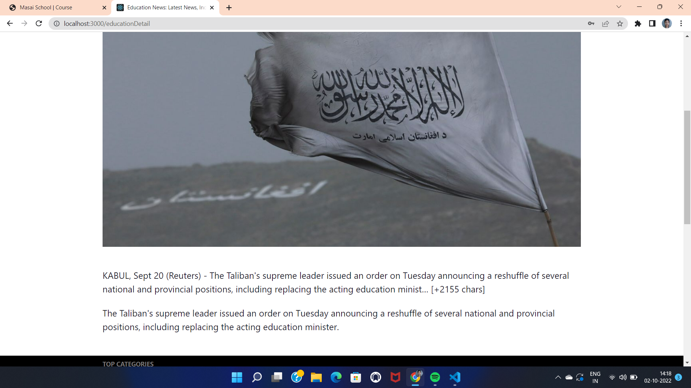

## Footer Page :

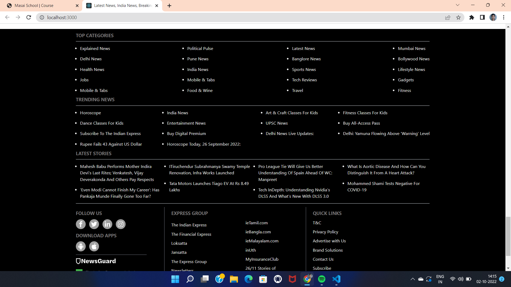

## Learnings :
- Real-life implementation of React JS, Chakra-UI along with Advanced Javascript.
- Time-management and Accountability.
- Learn to work in pressure.
- Learn to tackle problems and how to keep our-self motivated.

## Links :
- **Github** : https://github.com/rohiniee0028
- **Email** : rohini19394@gmail.com
- **LinkedIn** : https://www.linkedin.com/in/rohini-kushwaha-735b9322b/

